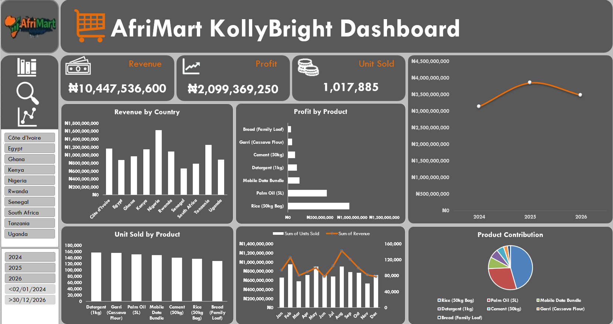

# AfriMart_Sales_Analysis_JohnEzugworie

## Project Overview
This project is an analysis of sales data from AfriMart KollyBright, a fictional African retail company. 
The goal of the dashboard is to help management understand and track sales performance, profitability and trends across countries and products using Microsoft Excel.

This project was created as a part of a data analysis portfolio to demonstrate Excel dashboards, data summarization, and business insight skills.

---

## Business Questions Answered
- What is the total revenue, profit, and units sold?
- Which countries generate the highest revenue?
- Which products are the most profitable?
- How does the revenue change in relation to unit sold over time?
- What are the percentage contribution of each product?

---
## Key KPIs
- Total Revenue
- Total Profit
- Total Units Sold

---
## Tools Used
- Microsoft Excel
- Pivot Tables
- Pivot Charts
- Excel Slicers
- Dashboard Design Techniques

---
## Dashboard Preview

---
## Key Insihts
- Nigeria contributed the highest share of total revenue.
- Some products recorded high sales volume but lower profit.
- Revenue trends show consistent growth over time.
- Product performance varies significantly by country.

---
## Files in This Repository
- [Sales Dataset](AfriMart_Sales_Dataset.xlsx)
- [Dashboard Screenshot](AfriMart_Sales_Dashboard_JohnEzugworie.png)
- [Sales Analysis](AfriMart_Sales_Analysis_JohnEzugworie.xlsx)
- README.md

---
## Conlusion
This project demonstrates how raw data can be transformed into clear, interactive dashboards that support data-driven business decisions. It highlights strong Excel fundamentals, analytical thinking, and professional project documentation.
